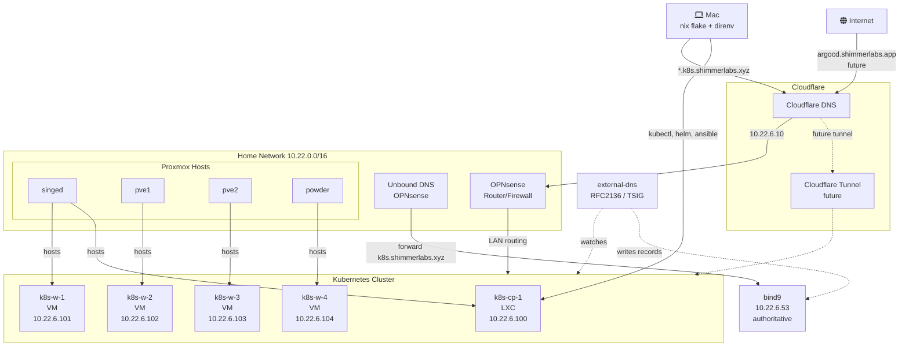
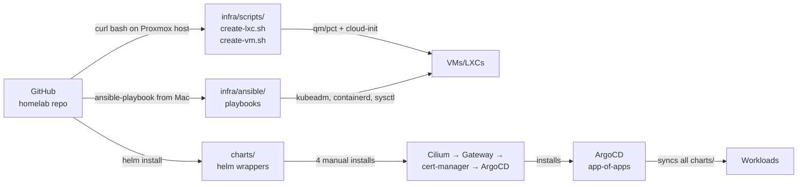
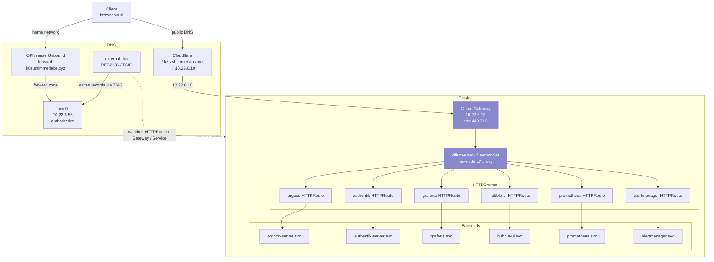
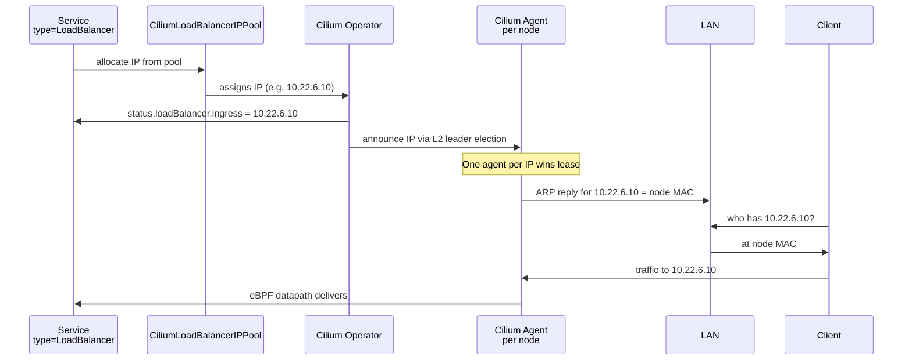
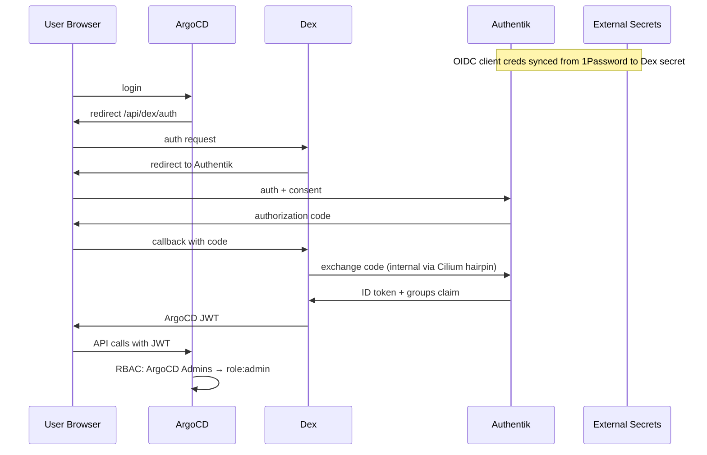
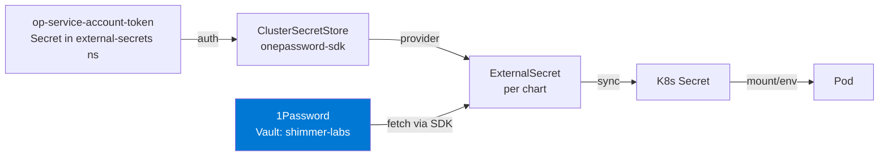
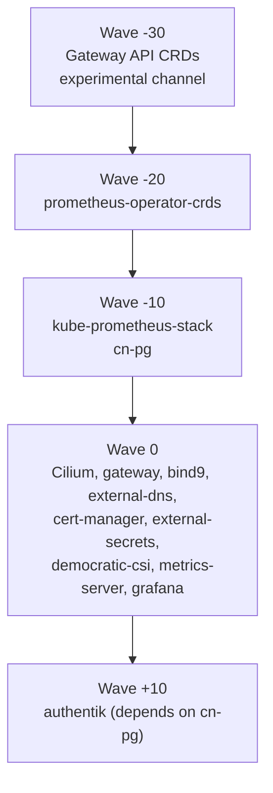
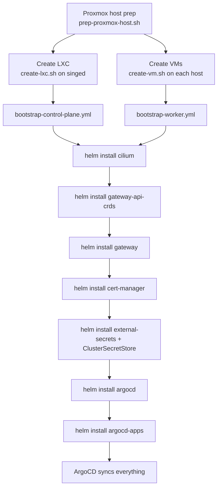

# Homelab Architecture

End-to-end architecture for the homelab Kubernetes cluster running on Proxmox.

## High-Level Topology



## Provisioning Pipeline



## Network & Ingress



## LoadBalancer IP Assignment (Cilium L2)



## Auth Flow (ArgoCD via Authentik OIDC)



## Secret Flow (1Password → Pods)



## ArgoCD Sync Wave Order



## Repo Layout

```
homelab/
├── flake.nix                          # nix dev shell
├── infra/
│   ├── scripts/
│   │   ├── create-lxc.sh              # control plane LXC
│   │   ├── create-vm.sh               # worker VMs
│   │   └── prep-proxmox-host.sh       # host sysctl/modules
│   └── ansible/
│       ├── inventory/                 # 1 CP + 4 workers
│       ├── roles/{common,kubeadm,control-plane,worker}/
│       └── playbooks/
└── charts/
    ├── argocd/                        # ArgoCD + Dex OIDC
    ├── argocd-apps/                   # app-of-apps generator
    ├── authentik/                     # OIDC IdP
    ├── cert-manager/                  # TLS via LE DNS-01 Cloudflare
    ├── cilium/                        # CNI + Gateway API + L2 announce
    ├── cn-pg/                         # CloudNative-PG operator
    ├── democratic-csi/                # iSCSI to TrueNAS
    ├── external-secrets/              # 1Password sync
    ├── gateway/                       # Cilium Gateway resource + cert
    ├── gateway-api-crds/              # experimental channel CRDs
    ├── grafana/
    ├── bind9/                         # authoritative DNS for k8s.shimmerlabs.xyz
    ├── external-dns/                  # writes records to bind9 via RFC2136 TSIG
    ├── kube-prometheus-stack/         # Prom + Alertmanager
    ├── metrics-server/
    └── prometheus-operator-crds/      # out-of-band CRDs
```

## Bootstrap Order



## Key Design Decisions

| Decision | Why |
|---|---|
| LXC for control plane | Lighter than VM, existing pattern in homelab |
| VMs for workers | Better isolation, kubeadm doesn't fight kernel module limits |
| Cilium kube-proxy replacement | eBPF perf, single L4/L7 stack |
| Cilium Gateway API (not Ingress) | Modern K8s standard, drops Traefik dependency |
| Cilium L2 (not MetalLB) | Single tool, no EndpointSlice label hack |
| Gateway API experimental CRDs | Cilium needs v1alpha2 served (TLSRoute) |
| bind9 + external-dns (RFC2136 TSIG) | Same tool family for internal + future public DNS; standard pattern |
| 1Password ESO + service account token | Secrets stay in 1Password, K8s pulls on-demand |
| ServerSideApply for kube-prometheus-stack | CRDs exceed 262144 byte annotation limit |
| Out-of-band prometheus-operator-crds | Same annotation limit problem; install separately |
| ArgoCD sync waves | Order CRD-providing apps before consumers |
| ignoreDifferences for cn-pg | Operator mutates CR; ArgoCD would loop reconciles |

## Future Work

- **Public ingress** — second Gateway with separate IP, OPNsense DNAT, Cloudflare Tunnel or port-forward
- **external-dns + Cloudflare** — auto-create public DNS records from HTTPRoute hostnames
- **Authentik IaC** — blueprints for groups/providers/applications instead of UI clicks
- **Re-enable ServiceMonitors** — for charts disabled during bootstrap (cert-manager, grafana, argocd, traefik gone)
- **Backup strategy** — Velero for cluster state, cn-pg backups to S3-compatible
